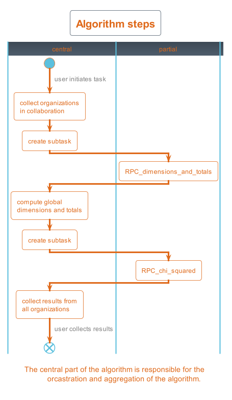

<h1 align="center">
  <br>
  <a href="https://euracan.eu/registries/starter/"></a>
</h1>

# Federated Chi-Squared Test for Independence

## Description
This package provides an algorithm to calculate the chi-squared test for independence on
a federated dataset for the EURACAN project. The general outline of the algorithm is as follows:

<p align="center">
    
</p>

The *partial* parts of the algorithm execute specific STARTER preprocessing, see
*vtg.preprocessing* for more details.

## Usage
The algorithm can be run as follows:

```python
from vantage6.client import Client

username = 'username@example.com'
password = 'password'
host = 'https://address-to-vantage6-server.domain'
port = 5000 # specify the correct port, 5000 is an example
api_path = '' # specify the correct api path

client = Client(host, port, api_path)
client.authenticate(username, password)
client.setup_encryption(None)

input_ ={
    'master': True,
    'method': 'dchisq',
    'args': [],
    'kwargs': {
        'columns': ['age', 'stage'],
        'probabilities': None,
        'organizations_to_include': [1, 2],
        'subset_rules': [{"subset": "age>30"}]
    },
    'output_format': 'json'
}

my_task = client.task.create(
    collaboration=COLLABORATION_ID,
    organizations=[ORGANIZATION_IDS[0]],
    name='GLM-example',
    description='Testing the Chi-Squared algorithm.',
    image='harbor2.vantage6.ai/starter/chisq:latest',
    input=input_,
    data_format='json'
)

client.wait_for_results(my_task.get('id'))
```

## Disclosure settings

`VTG_CHISQ_THRESHOLD`
Checks that the number of patients in the same group is at least the threshold. Default is set to 5.

`VTG_CHISQ_MIN_PATIENT_THRESHOLD`
The number of patients that should be present at the start of the analysis (after pre-processing) the default 10.

## TODO
- [ ] What happens with missing values?
- [ ] ...

